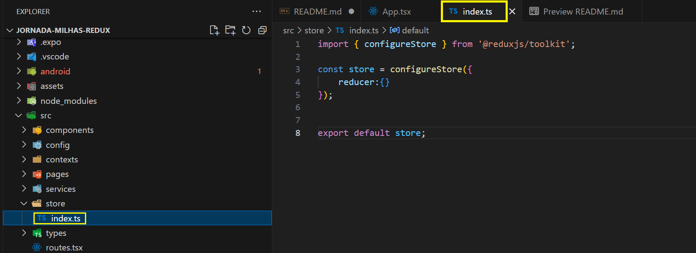
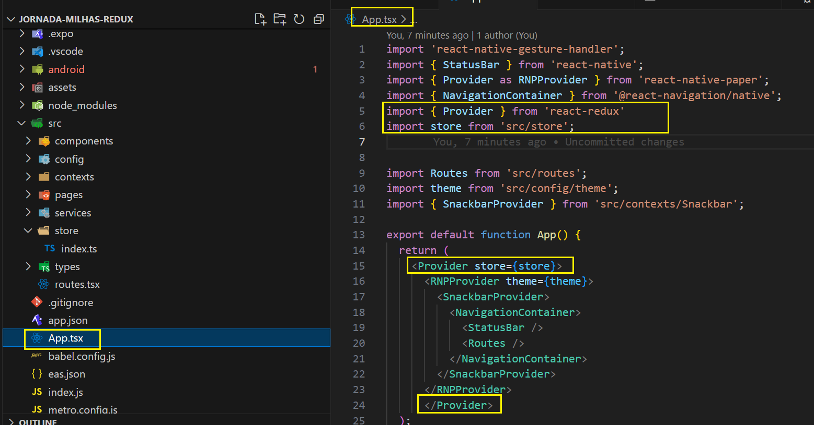
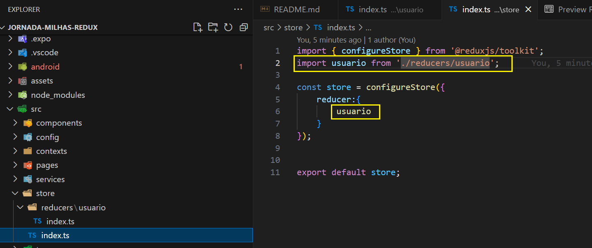
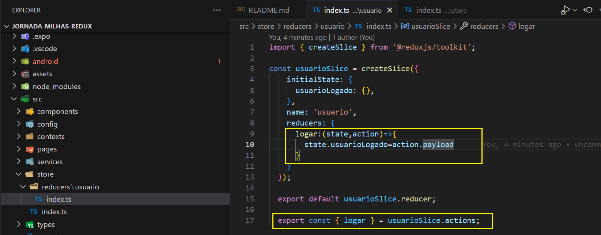
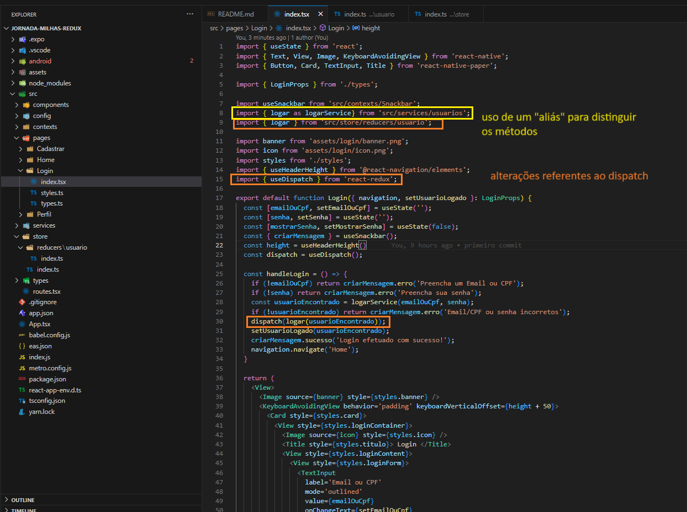
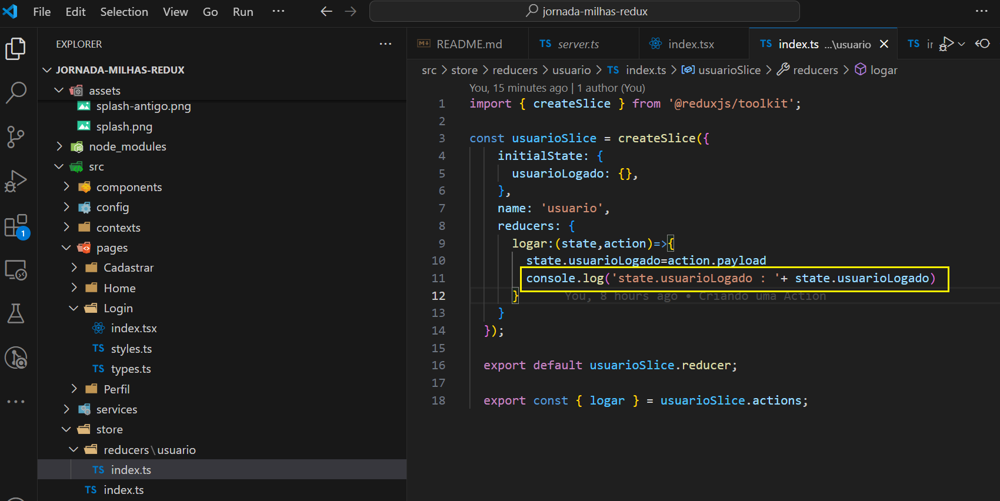
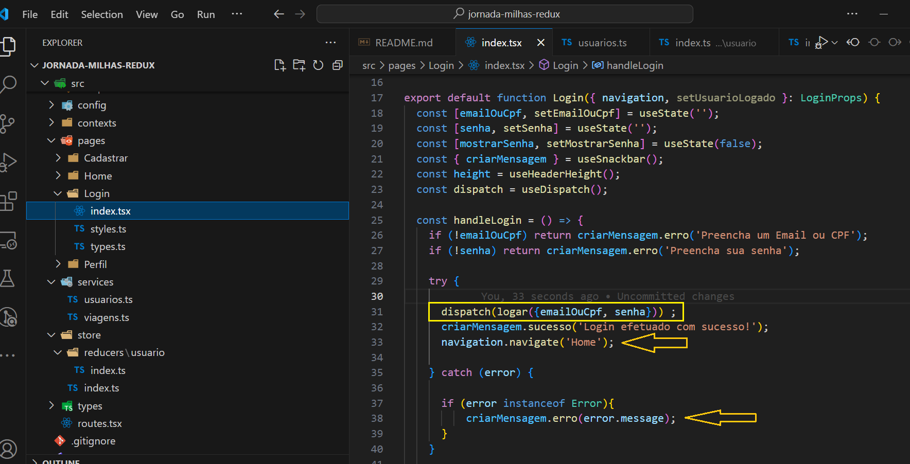
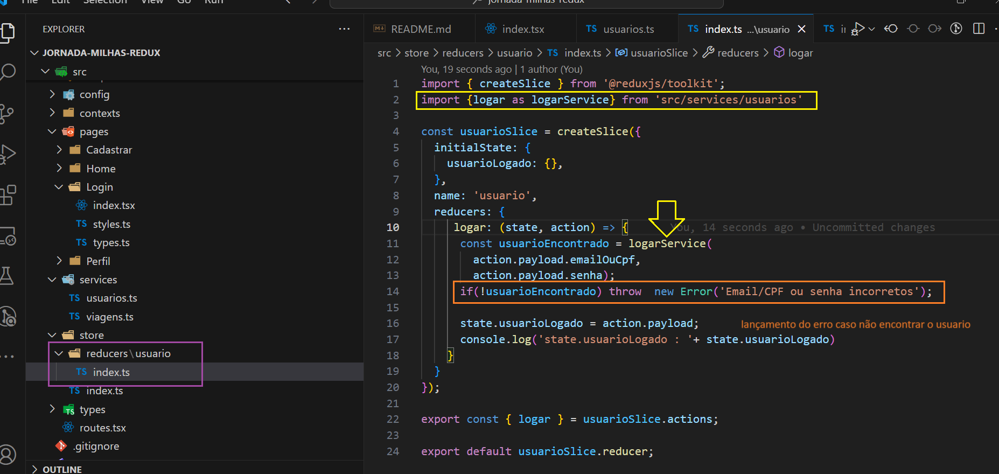
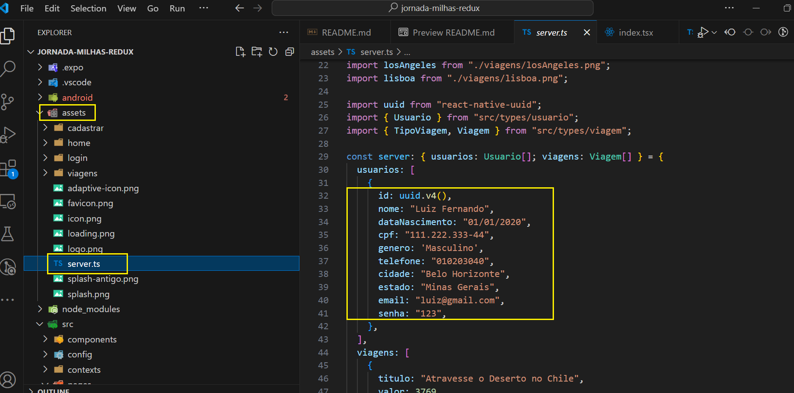
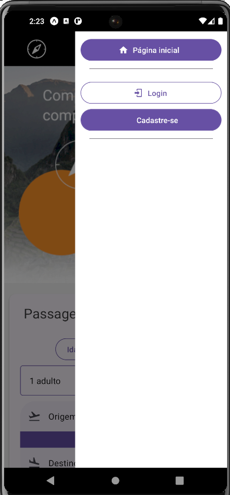

# React-native : introdução ao uso do Redux Toolkits

Este projeto é fruto do curso de 'React Native: gerenciamento de estados globais com redux toolkit' da plataforma ALURA
 

## Introdução

-  Neste curso utilza o projeto Jornada Milhas, onde é feita sua refatoração do o content API para se poder usar o redux. As partes refatoradas tiveram passadas o estado de usuário para dentro do Redux  foram :

  - Logar, 
  - Deslogar 
  - Cadastrar Usuário  

obs: neste curso não foram desenvolvidas qualquer tela da aplicação

## Tecnologias abordadas
 
  - Store (Armazenamento);
  - Reducer (Redutor);
  - Action (Ação);
  - Dispatch (Despachar);
  - Payload (Carga);
  - Ciclo de vida do Redux.

## Instalção das dependências

- yarn install

## Executar o projeto 

- npx expo start

## Implementando um Store

- Criação do store que sera usado para prover o estado para o aplicativo

  - store inicial

   - disponibilizando store em app.tsx

   

## Criando um slice

  - Criação do reducer de usuario e sua referência em store
    
    - reducer usuario

     

    - integração em store 

      

    obs: antes da adição desse reducer de usuario a aplicação apresentava uma warning "Store does not have a valid reducer." 

## Criando uma Action

 - criação da action logar e do seu export

   

## Usando o Dispatch

  Na tela de login, após a validação da ação de logar, será incluida a primeira ação.

  Primeiramente declarando a constante dispatch, importando 'logar' de reducer do usuario 
  obs: necessário dar um 'alias' ao 'logar' de service ficanco 'logarService'

    

  A titulo de teste, coloquei um 'console.log' dentro do reducer de usuario 

  

  ## migrar do contentAPI para o Redux

  - Passar  a responsabilidade de realizar a ação "logarService" para o reducer e ao invés de passar dois parametros para a função, passar um objeto contendo tal informação. 

  

  - dentro do reducer caso não seja realizado o login, lança-se um erro que será tratado na tela de login

  - Para testar, foi usado inicialmente um usuario já existente na base "mock"

  - acessar pelo menu "hamurguer" no alto a direita

  

  - logando com o usuário 'mock'

 

  - verificando logs de service e reducers

  

