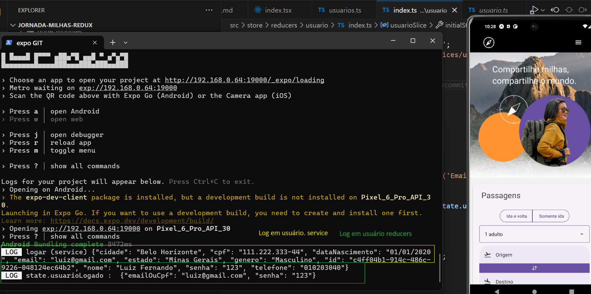
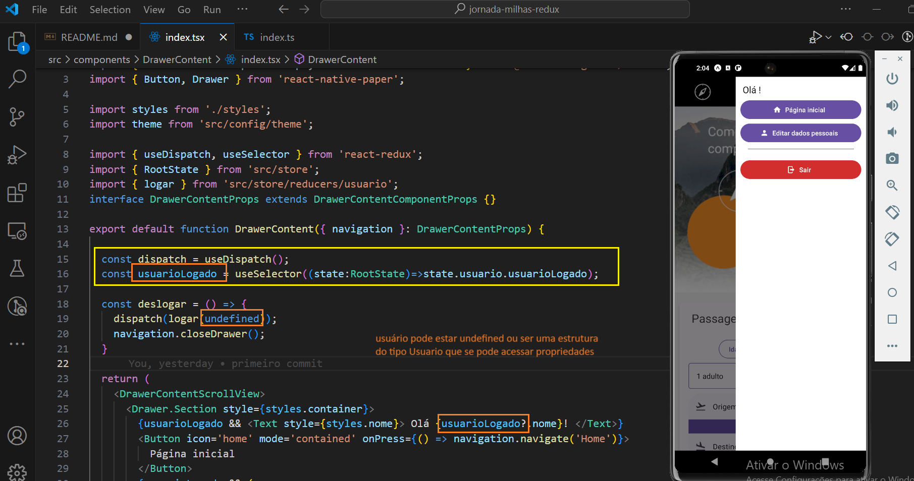

# React-native : introdução ao uso do Redux Toolkits

Este projeto é fruto do curso de 'React Native: gerenciamento de estados globais com redux toolkit' da plataforma ALURA
 

## Introdução

-  Neste curso utilza o projeto Jornada Milhas, onde é feita sua refatoração do o content API para se poder usar o redux. As partes refatoradas tiveram passadas o estado de usuário para dentro do Redux  foram :

  - Logar, 
  - Deslogar 
  - Cadastrar Usuário  

obs: neste curso não foram desenvolvidas qualquer tela da aplicação

## Tecnologias abordadas
 
  - Store (Armazenamento);
  - Reducer (Redutor);
  - Action (Ação);
  - Dispatch (Despachar);
  - Payload (Carga);
  - Ciclo de vida do Redux.

## Instalção das dependências

- yarn install

## Executar o projeto 

- npx expo start

## Implementando um Store

- Criação do store que sera usado para prover o estado para o aplicativo

  - store inicial

   - disponibilizando store em app.tsx

   

## Criando um slice

  - Criação do reducer de usuario e sua referência em store
    
    - reducer usuario

     

    - integração em store 

      

    obs: antes da adição desse reducer de usuario a aplicação apresentava uma warning "Store does not have a valid reducer." 

## Criando uma Action

 - criação da action logar e do seu export

   

## Usando o Dispatch

  Na tela de login, após a validação da ação de logar, será incluida a primeira ação.

  Primeiramente declarando a constante dispatch, importando 'logar' de reducer do usuario 
  obs: necessário dar um 'alias' ao 'logar' de service ficanco 'logarService'

    

  A titulo de teste, coloquei um 'console.log' dentro do reducer de usuario 

  

  ## migrar do contentAPI para o Redux

  - Passar  a responsabilidade de realizar a ação "logarService" para o reducer e ao invés de passar dois parametros para a função, passar um objeto contendo tal informação. 

  

  - dentro do reducer caso não seja realizado o login, lança-se um erro que será tratado na tela de login

  - Para testar, foi usado inicialmente um usuario já existente na base "mock"

  - acessar pelo menu "hamurguer" no alto a direita

  

  - logando com o usuário 'mock'

 

  - verificando logs de service e reducers

  

 ## Ajuste na funcionalidade da mensagem após o login

- Originalmente ao clicar no menu hambúrguer, no canto superior direito, se tinha a mensagem "Olá, Luiz Fernando!", devido a "logarService" ter passado para o reducer esta funcionalidade parou de funcionar

- abaixo a funcionalidade original

- Após essa refatoração, o reducer de usuairo fornece todas as informações necessários para o drawer 

 Realizando um teste de login é percebido que o usuairo está logado porem falta ainda concluir alguns pontos como o reconnhecimento das propriedades como o nome' 

- alteração em 'usuario reducer'

## Condlusão do ajuste da funcionalidade da mensagem após o login

 - Devido em action.payload (reducers/usuario) o usuarioLogado receber o e-mail ou CPF e senha, e não espera esses dados como nome etc. Isto é definido como um conflito de tipagem, porque especificamente não tipamos nossa action.

  - primeiramente é criada uma tipagem (interface) chamada 'LoginPayload' (vide imagem - amarelo)

  - em seguida a tipagem da action através de 'PayloadAction' do 'Redux Toolkit'

  - agora para finalizar a tipagem, modifica-se o 'state.usuarioLogado' para usar 'usuarioEncontrado' que vai conter todas as propriedades dos usuário ao invés do 'action.payload' que contem apenas dados de autenticação.

## Ação deslogar

- tambem é necessário criar uma action no reducer para deslogar do aplicativo assim como corrigir o parametro em 'handleDeslogar()' na ativação da ação 'deslogar' pelo dispatcher()

## Implementando o cadastro

 Considerando o codigo atual, será removido o 'cadastrarUsuario' que será feito pelo Redux.

Primeiro passo é criar a action 'cadastrar' em 'reducers/usuario'. Essa action é tipada usando a interface 'Omit' onde observa-se que o 'id' sera desconsiderado. Dentro a arrow function, alem de definir 'id' tambem é referido um array de 'usuarios' que sera declarado na interface 'InitialState' assim como na variavel 'initialState' que representa o estado inicial do reducer usuario. Voltando a 'cadastrar' se observa a adição do novo usuario vindo do payload juntamente com o id
 
obs: o array de usuarios e originado em no mock 'servers' em 'assets'

outro detalhe é a atualização do 'state' com o novo usuario

- Voltando a tela Cadastrar (index.ts) se faz a adaptação da chamada da action 

 Colocação de logs em reducers/usuario para na ação de cadastrar poder se pode observar os logs de 'usuario logado' e do array de usuarios

- logs em reducers/usuario

 - ação cadastrar

 
## Ultima refatoração

- Remoção das variaveis de estado em todos objetos que tenham referencia a 'usuarioLogado' e 'setUsuarioLogado' devido a esta informação vir de redux 'const usuarioLogado= useSelector((state:RootState)=>state.usuario.usuarioLogado)', começando por 'routes.tsx'

 obs: somente login e perfil precisaram desta referência

 

  obs: em 'compoments/drawerContent/index.ts' refatoraçai da interface "/interface DrawerContentProps extends DrawerContentComponentProps"

 

 - adaptação em 'Home/index'

  - remoção da tipagem 'Home/types' de 'export interface HomeProps' devido a não haver mais passagem de parametros, porem, necessário se ter a indicação da tipagem

  

 obs: anteriormente essa tipagem era indicada na interface

  

 - Apartir desse ponto as demais telas (Login,Cadastrar e Perfil) terão a mesma metodologia de retatoração. 

  obs: a titulo de estudo, referencias refatoradas estão sendo mantidas com comentários para reforçar o que foi mudado

  - ultima validação

  